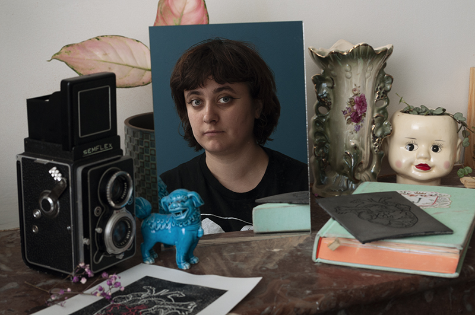

<em>Temps de lecture : 13 min.</em>

Pour moi l&rsquo;entretien de Judith &eacute;tait un peu particulier, puisque je la connaissais d&eacute;j&agrave; auparavant&nbsp;: ces derni&egrave;res ann&eacute;es nous nous sommes crois&eacute;es et recrois&eacute;es, &agrave; diff&eacute;rents endroits et &agrave; diff&eacute;rentes &eacute;poques. J&rsquo;&eacute;tais donc curieuse de conna&icirc;tre son parcours et d&rsquo;en apprendre plus sur elle et son travail.

Judith est une artiste polyvalente&nbsp;: elle pratique l&rsquo;illustration, la gravure, la s&eacute;rigraphie, et a &eacute;tudi&eacute; le graphisme. Mais aujourd&rsquo;hui c&rsquo;est majoritairement son travail de photographe qu&rsquo;elle pr&eacute;sente, &eacute;tant &agrave; son compte depuis septembre 2021. Ses photographies, r&eacute;alis&eacute;es uniquement en argentique, d&eacute;peignent un univers onirique o&ugrave; les fleurs sont omnipr&eacute;sentes. Que ce soit en noir et blanc ou en couleur, ses portraits d&eacute;gagent souvent une certaine douceur qui nous invite &agrave; imaginer l&rsquo;histoire qui se cache derri&egrave;re.

Quand je lui demande pourquoi elle a choisi de se consacrer principalement &agrave; la photo plut&ocirc;t qu&rsquo;au dessin, elle m&rsquo;explique d&rsquo;abord que les encouragements de son entourage, que ce soit ses parents, ses ami.e.s ou bien via les r&eacute;seaux sociaux, y ont grandement contribu&eacute;. Ce sont ces retours positifs qui lui ont permis de se rendre compte que ses photos &eacute;taient int&eacute;ressantes, voire m&ecirc;me avaient quelque chose en plus par rapport &agrave; son travail d&rsquo;illustratrice. Puis elle ajoute &laquo;&nbsp;je suis plus confiante dans mon boulot de photographe. M&ecirc;me quand je me compare aux autres, je trouve que mon boulot est bien&nbsp;&raquo;. Dans un domaine o&ugrave; l&rsquo;on est beaucoup &agrave; douter de nous et &agrave; avoir du mal &agrave; dire du positif de ce qu&rsquo;on cr&eacute;e (surtout lorsqu&rsquo;on est une femme), c&rsquo;est agr&eacute;able de l&rsquo;entendre parler avec autant de confiance et de lucidit&eacute; de son travail, et affirmer qu&rsquo;elle le trouve bon. Elle a conscience de ses comp&eacute;tences en photo, l&agrave; o&ugrave; elle estime ne pas avoir tout &agrave; fait le niveau qu&rsquo;elle souhaiterait en dessin. Et m&ecirc;me si elle dit &laquo;&nbsp;pr&eacute;f&eacute;rer un poil plus le dessin&nbsp;&raquo; et se repr&eacute;senter ses id&eacute;es d&rsquo;abord en illustration, elle les r&eacute;alise plut&ocirc;t en photo car elle se sent plus &agrave; l&rsquo;aise d&rsquo;un point de vue technique et sait qu&rsquo;elles rendront mieux. C&rsquo;est donc assez naturellement que la photo s&rsquo;est impos&eacute;e &agrave; elle comme technique de pr&eacute;dilection.

&nbsp;

&nbsp;

M&ecirc;me si elle pratique la photographie depuis qu&rsquo;elle a environ 8 ans - &agrave; la fois parce que son p&egrave;re, ancien journaliste, fait de la photo, et gr&acirc;ce aux ateliers organis&eacute;s par l&rsquo;un de ses instituteurs en primaire -, Judith n&rsquo;a pas toujours eu autant confiance en son travail. Lorsqu&rsquo;elle &eacute;voque les difficult&eacute;s qu&rsquo;elle a pu rencontrer pendant son parcours (qu&rsquo;elle d&eacute;crit comme &laquo;&nbsp;un peu un parcours de loser&nbsp;&raquo;), ce qui ressort tout de suite c&rsquo;est son passage, juste apr&egrave;s le lyc&eacute;e, &agrave; l&rsquo;ENCAL (l&rsquo;&Eacute;cole Cantonale des Arts de Lausanne). En 2012, elle y commence une ann&eacute;e pr&eacute;paratoire dans le but d&rsquo;int&eacute;grer par la suite la section cin&eacute;ma. Elle a notamment des cours de photo, mais &ccedil;a se passe mal ; elle n&rsquo;a que des retours n&eacute;gatifs de ses profs, qui n&rsquo;essaient pas de comprendre son travail et se contentent de lui dire que ses photos &laquo;&nbsp;ne vont pas&nbsp;&raquo;. Ces remarques vont la d&eacute;courager et la convaincre que ses images ne seront jamais assez bonnes, et il lui faudra du temps pour r&eacute;ussir &agrave; d&eacute;passer ces id&eacute;es sur elle-m&ecirc;me qu&rsquo;on lui a impos&eacute;. C&rsquo;est notamment pour cette raison qu&rsquo;apr&egrave;s son ann&eacute;e pr&eacute;paratoire, qui s&rsquo;est sold&eacute; par un refus de sa demande d&rsquo;int&eacute;grer la section cin&eacute;ma, elle a choisi de se diriger vers un BTS design graphique plut&ocirc;t que de se tourner vers la photographie. Elle m&rsquo;explique avec frustration qu&rsquo;elle s&rsquo;est sentie incomprise pendant sa pr&eacute;pa et qu&rsquo;elle ne comprend pas pourquoi ses profs n&rsquo;ont pas cherch&eacute; &agrave; lui donner de vrais conseils ou &agrave; l&rsquo;orienter vers quelque chose qui lui correspondait mieux (comme par exemple la photographie argentique, puisqu&rsquo;&agrave; l&rsquo;&eacute;poque elle montrait d&eacute;j&agrave; de l&rsquo;int&eacute;r&ecirc;t pour la r&eacute;paration d&rsquo;appareils anciens).

L&rsquo;autre aspect qui a bloqu&eacute; &ndash; et bloque encore- son avanc&eacute;e dans le monde de la photo et de l&rsquo;art, c&rsquo;est tout simplement l&rsquo;argent. A la fois car les &eacute;coles d&rsquo;art co&ucirc;tent chers (ce qui explique aussi son choix de se diriger vers un BTS de design graphique, moins long et moins on&eacute;reux qu&rsquo;un cursus de photo par exemple), mais aussi car gagner assez d&rsquo;argent pour vivre quand on se lance dans une carri&egrave;re artistique est compliqu&eacute;. Avant de commencer &agrave; travailler &agrave; temps plein en tant que photographe, Judith a travaill&eacute; 3 ans dans la vente&nbsp;; cela lui permettait de vivre correctement, mais &eacute;videmment elle n&rsquo;avait plus assez de temps et d&rsquo;&eacute;nergie &agrave; consacrer &agrave; ses projets photos. Elle m&rsquo;explique&nbsp;:&nbsp;&laquo;&nbsp;soit tu peux suivre financi&egrave;rement et t&rsquo;as pas de temps, soit tu ne peux pas suivre financi&egrave;rement et t&rsquo;as du temps&nbsp;; et je n&rsquo;arrive jamais &agrave; concilier les deux&nbsp;&raquo;. Pour l&rsquo;instant son activit&eacute; de photographe n&rsquo;est pas suffisante, et elle a donc d&eacute;cid&eacute; de se former dans un autre domaine qui lui permettra de s&lsquo;assurer un revenu plus stable et confortable tout en continuant &agrave; prendre des commandes et en consacrant ses week-end &agrave; la photo.

Au-del&agrave; de ces probl&eacute;matiques mat&eacute;rielles, j&rsquo;ai voulu savoir s&rsquo;il lui arrivait d&rsquo;&ecirc;tre d&eacute;motiv&eacute;e par un manque d&rsquo;inspiration, par la peur que son travail ne soit pas assez bon ou ne plaise pas. Mais pour elle il est facile de se motiver et d&rsquo;avoir des id&eacute;es, m&ecirc;me pour des projets personnels, et elle a maintenant suffisamment confiance en son travail pour ne pas redouter qu&rsquo;il ne soit pas &agrave; la hauteur. Bien s&ucirc;r, il lui arrive de craindre lors d&rsquo;un travail de commande de ne pas r&eacute;ussir &agrave; cerner l&rsquo;univers du.de la client.e et que le r&eacute;sultat ne lui convienne pas, mais elle sait que si ses photos ne plaisent pas, c&rsquo;est une question de go&ucirc;t et que &ccedil;a ne vient pas de la qualit&eacute; de ce qu&rsquo;elle fait. Elle me donne notamment l&rsquo;exemple d&rsquo;une commande de portraits qu&rsquo;elle a r&eacute;alis&eacute;, dont le r&eacute;sultat ne plaisait pas &agrave; la cliente. Mais celle-ci n&rsquo;a pas remis en cause le travail de Judith, et elles sont arriv&eacute;es &agrave; la conclusion que si &ccedil;a ne lui convenait pas, c&rsquo;&eacute;tait peut-&ecirc;tre plut&ocirc;t parce qu&rsquo;elle n&rsquo;arrivait pas &agrave; encore &agrave; bien communiquer &agrave; Judith ce qu&rsquo;elle voulait, que pour l&rsquo;instant leurs univers &laquo;&nbsp;n&rsquo;arrivaient pas &agrave; entrer en symbiose&nbsp;&raquo;. Judith ajoute que m&ecirc;me si cela l&rsquo;a beaucoup questionn&eacute;, elle a fini par admettre que &laquo;&nbsp;peut-&ecirc;tre le probl&egrave;me ce n&rsquo;est pas toujours [elle]&nbsp;&raquo;, que ce n&rsquo;&eacute;tait ni de sa faute ni de celle de sa cliente si pour l&rsquo;instant &ccedil;a ne fonctionnait pas. &nbsp;

&nbsp;Globalement, Judith est entour&eacute;e de personnes qui ont un &oelig;il bienveillant sur ce qu&rsquo;elle fait&nbsp;; par exemple montrer son travail sur les r&eacute;seaux sociaux n&rsquo;est pas une source d&rsquo;angoisse ou une pression pour elle. C&rsquo;est plut&ocirc;t quelque chose qui la porte, car cela lui permet de se rendre compte qu&rsquo;il est appr&eacute;ci&eacute;. Celleux qui la suivent sont enthousiastes et n&rsquo;h&eacute;sitent pas &agrave; partager son travail ou &agrave; le commenter, ce qui lui a permis de rencontrer pas mal de gens qu&rsquo;elle suit et dont elle soutient le travail &agrave; son tour&nbsp;: &laquo;&nbsp;on se nourrit un peu les uns les autres, on s&rsquo;explique les proc&eacute;d&eacute;s et les technique&nbsp;&raquo;. Avoir autour d&rsquo;elle des personnes cr&eacute;atives la motive, et surtout pour elle l&rsquo;entraide est primordiale. C&rsquo;est particuli&egrave;rement important dans le domaine de la photo argentique, o&ugrave; elle a pu constater que beaucoup de connaissances &eacute;taient d&eacute;tenues par des hommes qui ne veulent pas partager ce qu&rsquo;ils savent, notamment avec les personnes qu&rsquo;ils per&ccedil;oivent comme femme&nbsp;: &laquo;&nbsp;sur les groupes de r&eacute;paration d&rsquo;appareils photo, quand t&rsquo;es affich&eacute;e meuf on te parle pas du tout de la m&ecirc;me fa&ccedil;on que quand t&rsquo;es affich&eacute; mec&nbsp;&raquo;. A chaque fois qu&rsquo;elle a cherch&eacute; des conseils, elle a &eacute;t&eacute; soit ignor&eacute;e, soit trait&eacute;e avec condescendance&nbsp;; or, pour elle il est important que toutes ces connaissances soient partag&eacute;es et transmises si on veut que la photo argentique perdure. &nbsp;Elle ajoute&nbsp;: &laquo;&nbsp;s&rsquo;il n&rsquo;y a pas de mise en commun du savoir, la photo argentique c&rsquo;est un truc qui va mourir&nbsp;&raquo;.

&nbsp;

&nbsp;

&nbsp;

Le sujet des r&eacute;seaux sociaux m&rsquo;entra&icirc;ne forc&eacute;ment vers la question de comment g&eacute;rer ce flux de photos tr&egrave;s important auquel on est expos&eacute;.e, surtout quand on est soi-m&ecirc;me un.e cr&eacute;ateur.rice d&rsquo;image. Judith m&rsquo;explique que &ccedil;a lui arrive parfois de se comparer &agrave; d&rsquo;autres personnes, mais qu&rsquo;elle essaie de d&eacute;samorcer ces comportements un peu toxiques : plut&ocirc;t que de se dire qu&rsquo;elle n&rsquo;est pas assez bonne, elle pr&eacute;f&egrave;re se dire &laquo;&nbsp;je n&rsquo;ai pas encore ce niveau mais je vais y arriver&nbsp;&raquo;. Quand je lui demande si le fait que des personnes plus jeunes qu&rsquo;elle fassent des choses qu&rsquo;elle consid&egrave;re comme &laquo;&nbsp;meilleures&nbsp;&raquo; ou rencontrent plus de succ&egrave;s peut l&rsquo;affecter, elle me r&eacute;pond que cela lui pesait avant. Mais maintenant elle trouve &ccedil;a &laquo;&nbsp;trop cool&nbsp;&raquo; de les voir r&eacute;ussir :&nbsp;&laquo;&nbsp;je pr&eacute;f&egrave;re &ecirc;tre potes avec eux qu&rsquo;en concurrence avec eux&nbsp;&raquo;. Pour elle, chacun.e va &agrave; son rythme, et c&rsquo;est important de prendre son temps&nbsp;: ne pas &ecirc;tre reconnu.e maintenant ne veut pas dire qu&rsquo;on ne le sera jamais. C&rsquo;est cet optimisme qui lui a permis de finir par d&eacute;passer l&rsquo;exp&eacute;rience n&eacute;gative que f&ucirc;t son ann&eacute;e pr&eacute;paratoire, d&rsquo;oser se lancer &agrave; son compte, et surtout de continuer &agrave; garder confiance en ce qu&rsquo;elle fait. Ce que j&rsquo;ai trouv&eacute; motivant en &eacute;coutant Judith, c&rsquo;est qu&rsquo;elle arrive &agrave; faire la part des choses et &agrave; relativiser le fait que pour l&rsquo;instant elle ne vit pas uniquement de son travail de photographe, sans pour autant le remettre en cause ou le d&eacute;valoriser, ou se dire qu&rsquo;elle n&rsquo;y arrivera jamais.

Ainsi, m&ecirc;me si elle a mis du temps &agrave; s&rsquo;assumer comme photographe alors qu&rsquo;elle pratique depuis de nombreuses ann&eacute;es, m&ecirc;me si elle n&rsquo;a pas forc&eacute;ment pu faire les &eacute;tudes qu&rsquo;elle voulait, elle sait que &ccedil;a ne conditionne pas son travail ou le reste de sa carri&egrave;re. Pour elle, &laquo;&nbsp;ce n&rsquo;est pas une fatalit&eacute; d&rsquo;avoir un parcours de loser&nbsp;&raquo;. Et le cursus scolaire ne fait pas tout&nbsp;: m&ecirc;me si les &eacute;coles d&rsquo;art sont souvent pr&eacute;sent&eacute;es comme une chance &agrave; ne pas manquer, une mani&egrave;re de devenir un.e artiste accompli.e en seulement 2 ou 3 ans, en r&eacute;alit&eacute; ce n&rsquo;est qu&rsquo;une partie du chemin.&nbsp;Chacun.e y prend ce qu&rsquo;iel a &agrave; y prendre mais l&rsquo;apprentissage ne s&rsquo;arr&ecirc;te pas lorsqu&rsquo;on obtient son dipl&ocirc;me. Judith conclue : &laquo;&nbsp;J&rsquo;ai peut-&ecirc;tre un chemin diff&eacute;rent, je prends peut-&ecirc;tre plus mon temps, mais il y a des personnes qui sortent de [l&rsquo;ENCAL] qui trouvent pas de boulot non plus&nbsp;: au final on se retrouve tous dans le m&ecirc;me bac&nbsp;&raquo;.

<em>Retrouvez Judith sur instagram <a href="https://www.instagram.com/judithsevy_/">@judithsevy_</a> pour son travail de photographe et <a href="https://www.instagram.com/foulesantementale/">@foulesantementale</a> pour ses illustrations.</em>

 <em></em>
