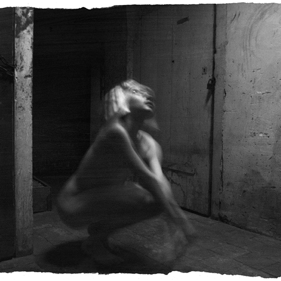
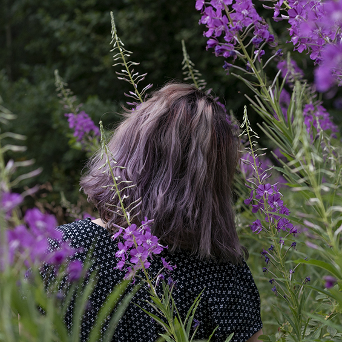
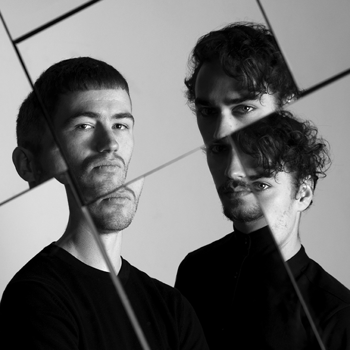

&nbsp; &nbsp; &nbsp;Cr&eacute;&eacute; en 2022, Bleu Lumi&egrave;re est un projet sur l&rsquo;art &ndash; ou plut&ocirc;t, sur les artistes. Comment se construit notre vie quand l&rsquo;art et la cr&eacute;ation en sont une part majeure ? Comment g&egrave;re-t-on le manque de motivation et d&rsquo;inspiration ? Quelle place est donn&eacute;e aux artistes dans notre soci&eacute;t&eacute; ? Tous.tes les cr&eacute;ateur.ice.s sont confront&eacute;.e.s &agrave; des questionnements similaires, j&rsquo;ai donc eu envie d&rsquo;&eacute;changer avec d&rsquo;autres personnes autour de ces sujets. Il me semblait important de partager le fruit de ces &eacute;changes pour que n&rsquo;importe qui puisse les lire et, potentiellement, en tirer quelque chose de positif, d&rsquo;inspirant ou de rassurant. &Eacute;tant photographe, j&rsquo;ai trouv&eacute; &ccedil;a logique de r&eacute;aliser moi-m&ecirc;me les portraits qui accompagnent chaque article, en essayant de mettre en avant l&rsquo;univers de chacun.e. Chaque participant.e peut &eacute;galement, s&rsquo;iel le souhaite, &eacute;changer l&rsquo;une de ses r&eacute;alisations (tirage, photo, croquis&hellip;) contre celle de la personne interview&eacute;.e avant lui.elle, afin de faire circuler ces &oelig;uvres d&rsquo;une mani&egrave;re un peu diff&eacute;rente.

Vous souhaitez participer ? C&rsquo;est par ici&nbsp;!

&nbsp;

Derri&egrave;re le projet

Je m&rsquo;appelle C&eacute;cile, et je suis photographe. J&rsquo;aime particuli&egrave;rement photographier et mettre en sc&egrave;ne les autres, ainsi que faire des cyanotypes et des autoportraits. Quand je ne suis pas occup&eacute;e &agrave; &eacute;crire pour Bleu Lumi&egrave;re ou &agrave; prendre des photos, je passe le temps en r&ecirc;vant &agrave; une petite maison au creux des bois, en &eacute;coutant les m&ecirc;mes chansons en boucle, ou en lisant des histoires fantastiques.

Vous pouvez retrouver mes photos sur instagram <a href="https://instagram.com/cecile.kl?igshid=YmMyMTA2M2Y=">@cecile.kl</a>, ou me contacter &agrave; <a href="mailto:contact@bleu-lumi&egrave;re.com">contact@bleu-lumi&egrave;re.com</a> !

&nbsp;   
